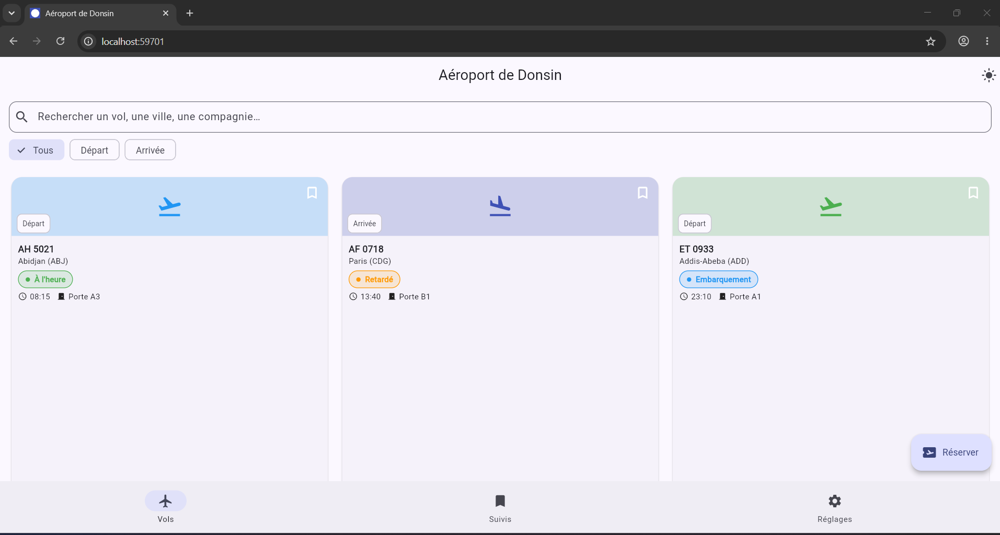
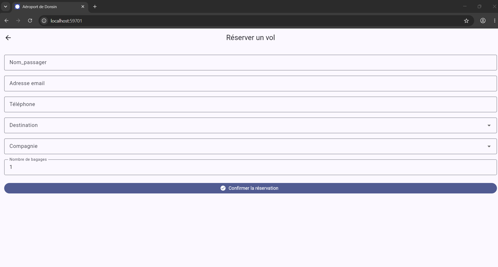
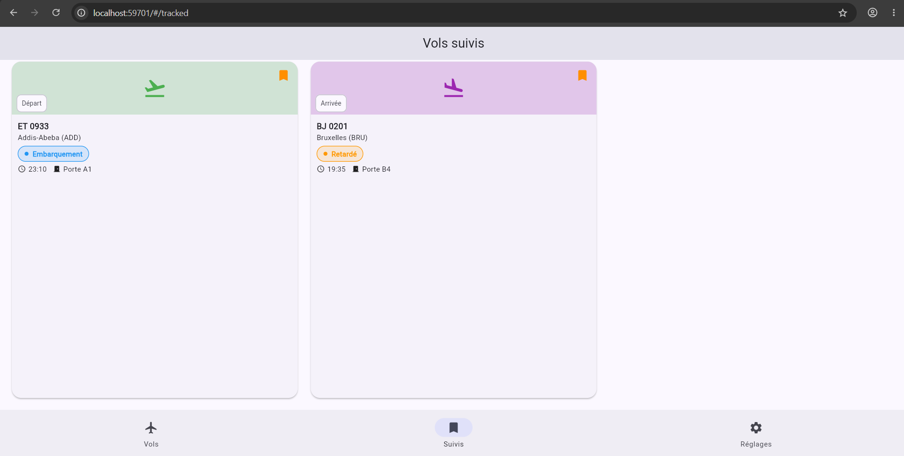
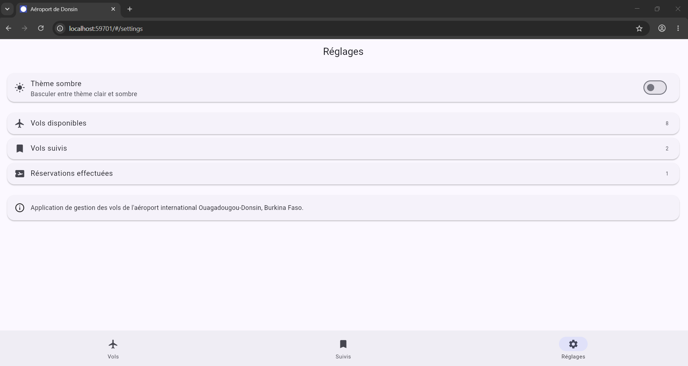
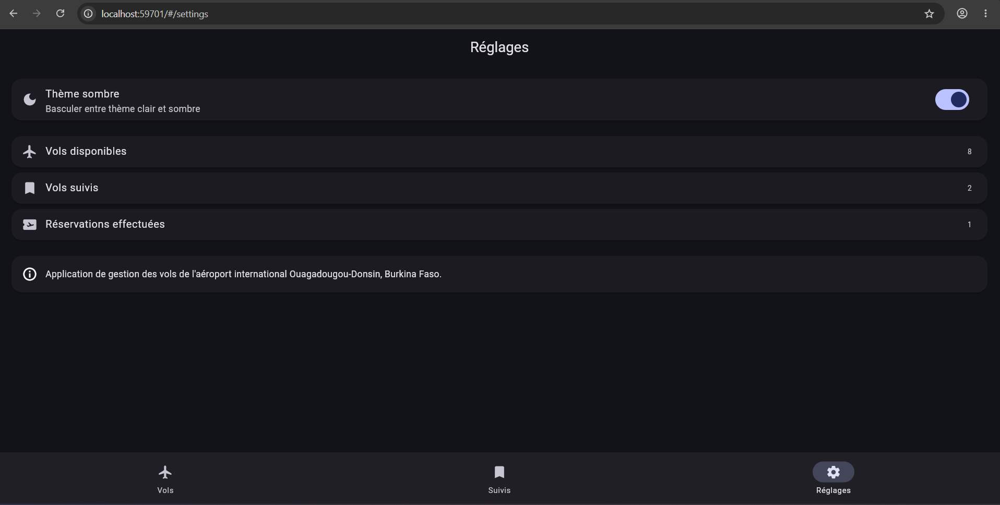
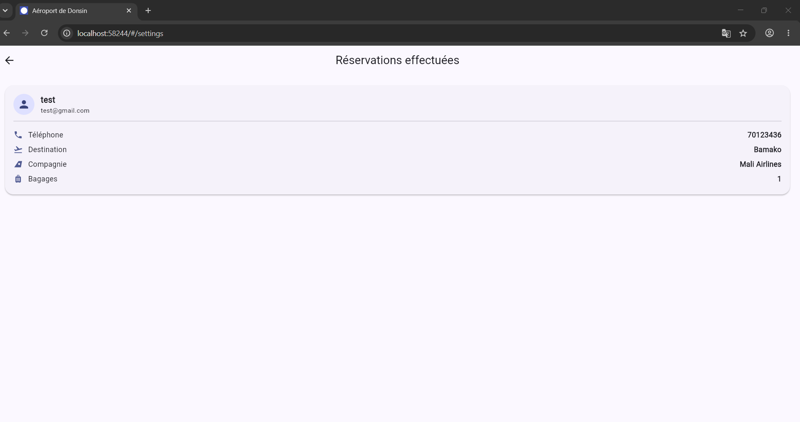
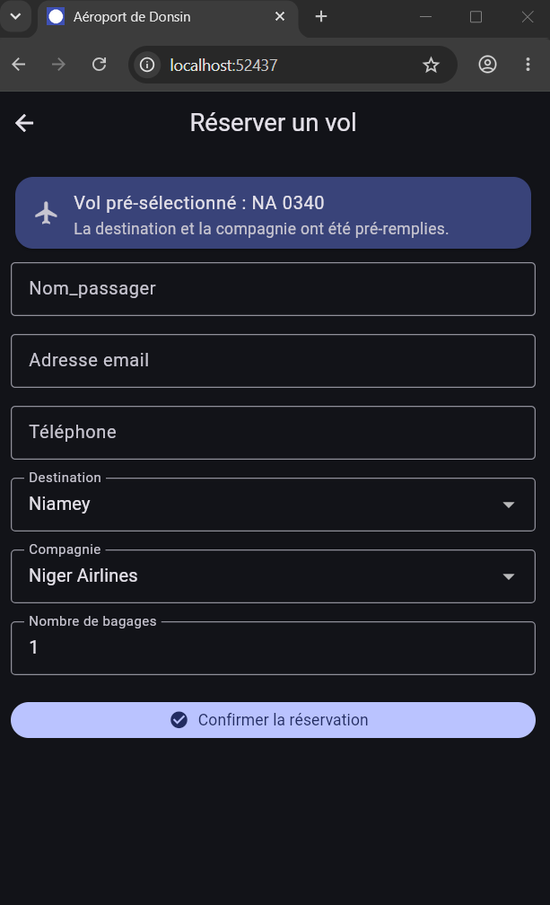
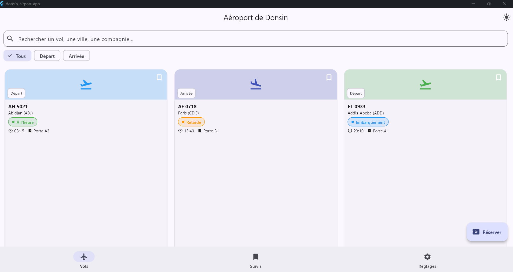

# ✈️ Donsin Airport App

Application Flutter multi-écrans de **gestion des vols de l'aéroport international Ouagadougou-Donsin (Burkina Faso)**. Ce projet a été réalisé pour valider la maîtrise des widgets Flutter et de la navigation avec GoRouter.

## 📱 Aperçu des fonctionnalités

- Consultation en temps réel des vols au départ et à l'arrivée de l'aéroport de Donsin
- Recherche et filtrage des vols (par numéro, ville, compagnie, type de vol)
- Fiche détaillée de chaque vol (itinéraire, horaires, porte d'embarquement, statut, prix)
- Réservation d'un vol via un formulaire validé (nom, email, téléphone, bagages)
- Suivi de vols favoris avec système de signets
- Thème clair / sombre activable à tout moment

## 🗂️ Écrans de l'application

| Écran | Description |
|---|---|
| **Accueil** (`/`) | Liste/grille des vols avec barre de recherche et filtres par type (Départ / Arrivée) |
| **Détail du vol** (`/flight/:id`) | Informations complètes du vol sélectionné, accessible via un paramètre d'URL |
| **Réservation** (`/book`) | Formulaire de réservation avec validation (nom_passager, email, téléphone, destination, compagnie, nombre de bagages), pré-rempli si un vol a été choisi depuis le détail |
| **Vols suivis** (`/tracked`) | Liste des vols marqués comme favoris par l'utilisateur |
| **Réglages** (`/settings`) | Bascule du thème clair/sombre et résumé des statistiques (vols disponibles, vols suivis, réservations), chaque ligne étant cliquable pour accéder à la liste correspondante |
| **Réservations effectuées** (`/reservations`) | Détail de toutes les réservations effectuées durant la session, accessible depuis Réglages |

## 🧭 Navigation

La navigation est gérée avec **GoRouter** et des routes nommées (`home`, `flight-detail`, `booking`, `reservations`, `tracked`, `settings`), organisées autour d'un `ShellRoute` qui conserve une barre de navigation persistante entre les trois onglets principaux.

## 🧱 Architecture technique

```
donsin_airport_app/
├── android/                 # Projet Android natif (ouvrable dans Android Studio)
├── ios/                     # Projet iOS natif (ouvrable dans Xcode)
├── web/                     # Point d'entrée web (index.html, manifest.json, icônes)
├── lib/
│   ├── main.dart            # Point d'entrée
│   ├── models/               # Modèles de données (Flight, FlightStatus...)
│   ├── data/                 # Données statiques initiales (séparées de l'UI)
│   ├── state/                 # Gestion d'état global avec ChangeNotifier + provider
│   ├── theme/                 # Thèmes clair / sombre
│   ├── router/                # Configuration GoRouter
│   ├── screens/                # Écrans de l'application
│   ├── services/                # Sauvegarde JSON / MySQL, avec variantes web via export conditionnel
│   └── widgets/                # Composants réutilisables
│       ├── flight_card.dart    # Carte de vol (Stack + Card + Hero)
│       ├── status_badge.dart   # Badge de statut coloré
│       ├── section_title.dart  # Titre de section stylisé
│       ├── empty_state.dart    # État vide pour listes filtrées
│       └── main_scaffold.dart  # Scaffold + BottomNavigationBar partagé
├── test/                     # Tests unitaires et widget
├── sql/                      # Schéma MySQL
└── screenshots/               # Captures d'écran (à compléter, voir screenshots/README.md)
```

## 💾 Persistance des réservations

Chaque réservation soumise dans `BookingScreen` est sauvegardée sur **deux canaux indépendants** via `AppState.addBooking()`. Les deux services sont sélectionnés **à la compilation** selon la plateforme cible (voir « Compatibilité multiplateforme » ci-dessous), afin que la version web n'essaie jamais d'utiliser `dart:io`.

1. **Fichier / stockage JSON**
   - Sur Android, iOS et desktop (`lib/services/json_storage_service_io.dart`) : écrit dans un vrai fichier `reservations.json`, situé dans le répertoire de documents de l'application (`path_provider` → `getApplicationDocumentsDirectory()`). Ce fichier survit aux redémarrages de l'app mais reste propre à l'appareil.
   - Sur le web (`lib/services/json_storage_service_web.dart`) : le même contenu JSON est stocké dans le `localStorage` du navigateur (pas de système de fichiers disponible côté navigateur).

2. **Base de données MySQL**
   - Sur Android, iOS et desktop (`lib/services/mysql_service_io.dart`) : connexion réelle via `package:mysql_client` à la table `reservations` (voir `sql/schema.sql`), créée automatiquement au premier lancement si elle n'existe pas. Les paramètres de connexion (hôte, port, utilisateur, mot de passe, nom de base) se configurent dans `MySqlConfig`.
   - Sur le web (`lib/services/mysql_service_web.dart`) : un navigateur ne peut pas ouvrir de socket TCP brut vers un serveur MySQL, donc ce canal échoue proprement avec un message explicite (`DatabaseUnavailableOnWebException`) — la réservation reste tout de même enregistrée via le canal JSON (localStorage).

   ⚠️ **Important** : intégrer des identifiants MySQL en clair dans une app mobile n'est pas une pratique sécurisée pour la production (ils seraient visibles dans l'APK) — normalement on passe par une API backend intermédiaire. Cette connexion directe est fournie ici à des fins **pédagogiques**.

   Pour préparer la base avant le premier lancement :
   ```bash
   mysql -u root -p < sql/schema.sql
   ```
   Si vous testez sur un émulateur Android avec un serveur MySQL sur votre machine, l'hôte par défaut `10.0.2.2` pointe vers `localhost` de l'ordinateur hôte.

Les deux sauvegardes sont **indépendantes** : si l'une échoue (pas de réseau, serveur éteint, disque plein, web…), l'autre continue de fonctionner normalement, et l'utilisateur en est informé précisément (voir section suivante).

### 🌐 Compatibilité multiplateforme (Android / iOS / Web)

`json_storage_service.dart` et `mysql_service.dart` sont chacun de simples **fichiers d'export conditionnel** :

```dart
export 'json_storage_service_web.dart'
    if (dart.library.io) 'json_storage_service_io.dart';
```

Concrètement : le compilateur choisit automatiquement la bonne implémentation selon la cible (web → jamais `dart:io`, Android/iOS/desktop → version fichier + MySQL). Cela garantit que `package:mysql_client` (qui dépend de `dart:io`) n'est **jamais inclus dans le bundle web**, et donc que `flutter build web` fonctionne sans modification.

## ⚠️ Gestion des exceptions

Toutes les erreurs de sauvegarde sont capturées et transformées en exceptions personnalisées dans `lib/services/exceptions/app_exceptions.dart` (`DatabaseConnectionException`, `DatabaseAuthenticationException`, `DatabaseTimeoutException`, `JsonFileWriteException`, etc.). Chacune porte :
- un `message` rédigé en français, sans jargon technique, directement affichable à l'utilisateur (ex. *« Impossible de joindre le serveur de la base de données. Vérifiez votre connexion internet, puis réessayez. »*) ;
- un `technicalDetails` optionnel, réservé aux logs/au débogage, jamais montré à l'utilisateur.

Après soumission du formulaire, `BookingScreen` affiche un message personnalisé selon le résultat :
- ✅ succès complet (JSON + MySQL) → confirmation verte ;
- ⚠️ succès partiel (un seul des deux canaux a réussi) → avertissement orange, avec le message précis de l'échec ;
- ❌ échec complet → message rouge, et le formulaire reste ouvert pour ne pas perdre la saisie de l'utilisateur.

Aucune donnée n'est écrite en dur dans les widgets : les vols proviennent de `data/flights_data.dart` et l'état (favoris, réservations, thème) est centralisé dans `state/app_state.dart`.

L'interface est **responsive** : la grille de vols passe de 2 colonnes (mobile) à 3 colonnes (tablette, largeur ≥ 600px) grâce à un `LayoutBuilder`.

## ✅ Tests

Le dossier `test/` contient :

- `test/models/flight_test.dart` — tests unitaires du modèle `Flight` et de ses extensions (`FlightTypeLabel`, `FlightStatusLabel`)
- `test/services/app_exceptions_test.dart` — vérifie que chaque exception personnalisée porte un message clair et sans jargon technique
- `test/state/app_state_test.dart` — tests unitaires de la gestion d'état (`AppState`) : thème, vols suivis, réservations, sauvegarde JSON + MySQL (succès, échec partiel, échec total), via des doubles de test (`test/fakes/fake_storage.dart`) qui n'accèdent ni au disque ni au réseau
- `test/screens/booking_screen_test.dart` — tests widget de la validation du formulaire de réservation et du message affiché après soumission

Pour les lancer :

```bash
flutter test
```

## 🚀 Lancer le projet

1. Installer [Flutter](https://docs.flutter.dev/get-started/install) (SDK ≥ 3.0.0)
2. Cloner le dépôt :
   ```bash
   git clone https://github.com/<votre-utilisateur>/donsin_airport_app.git
   cd donsin_airport_app
   ```
3. Installer les dépendances :
   ```bash
   flutter pub get
   ```
4. Lancer l'application :
   ```bash
   flutter run                 # sur l'appareil/émulateur connecté par défaut
   flutter run -d chrome       # sur le web
   flutter run -d <device-id>  # cibler un appareil précis (flutter devices pour la liste)
   ```
5. Pour ouvrir le projet Android natif dans **Android Studio** : `File > Open` puis sélectionner le dossier `android/` (ou le dossier racine du projet, Android Studio détecte automatiquement le module Flutter).
6. Pour tester le rendu tablette, lancer sur un émulateur en mode paysage ou redimensionner la fenêtre (Flutter Web/Desktop) au-delà de 600px de large.
7. Pour compiler pour chaque plateforme :
   ```bash
   flutter build apk      # Android
   flutter build ios      # iOS (nécessite macOS + Xcode)
   flutter build web      # Web
   flutter build windows    # Microsoft Store 
   ```

## 📸 Captures d'écran

Voir le dossier [`screenshots/`](screenshots/) — les images doivent être ajoutées après un premier lancement de l'application (écran d'accueil, recherche/filtres, détail d'un vol, formulaire de réservation, thème sombre, vols suivis). Le README du dossier détaille le nom de fichier attendu pour chaque capture.

## 📦 Dépendances principales

- [`go_router`](https://pub.dev/packages/go_router) — navigation par routes nommées
- [`provider`](https://pub.dev/packages/provider) — gestion d'état global

## 📄 Licence

Projet réalisé à des fins pédagogiques.


## Captures d'écran

I. ACCUEIL
La page d'accueil ci dessous affiche la liste des vols départs et arrivés avec le bouton pour réserver un vol.


II. RESERVATION D'UN VOL
Cette page permet aux usagers de l'aéroport de Donsin du Burkina Faso d'effectuer de réservation de vols


III. SUIVIS DES VOLS
Cet interface affiche la liste des vols que j'ai décidé de suivre.


IV. REGLAGES 

1. Présentation avec un fond d'écran dont le thème clair
Cette page présente l'application avec un fond d'écran dont le thème clair.


2. Présentation avec un fond d'écran dont le thème sombre
Cette page présente l'application avec un fond d'écran dont le thème sombre. 
 

3. Réservations effectuées
Cette page présente la liste des réservations de vols enregistrés


3. Réservations d'un vol au format SMARTPHONE
Cette page présente l'écran de réservations d'un vol départ


4. Application .exe pour Windows
Cette page présente l'écran de l'application .exe pour installer sur ordinateur Windows
